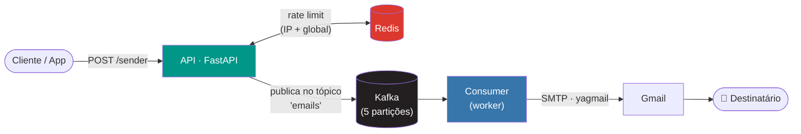

<h1 align="center">📬 MCP Sender</h1>

<p align="center">
  
</p>


<p align="center">
  <strong>Microsserviço assíncrono de envio de e-mails, orquestrado com Kafka, Redis e FastAPI.</strong>
</p>

<p align="center">
  
  
  
  
  
</p>

<p align="center">
  
  
  
  
</p>

<p align="center">
  <a href="#-sobre-o-projeto">Sobre</a> •
  <a href="#-funcionalidades">Funcionalidades</a> •
  <a href="#️-arquitetura">Arquitetura</a> •
  <a href="#-stack-tecnológica">Stack</a> •
  <a href="#-instalação-e-execução">Instalação</a> •
  <a href="#-uso-da-api">Uso da API</a> •
  <a href="#-testes">Testes</a> •
  <a href="#-cicd">CI/CD</a>
</p>

---

## 📖 Sobre o projeto

**MCP Sender** é um serviço de envio de e-mails desacoplado e escalável, construído em torno de uma arquitetura orientada a eventos. Em vez de enviar o e-mail de forma síncrona dentro da própria requisição HTTP, a API apenas **publica a intenção de envio em um tópico Kafka** e devolve uma resposta imediata ao cliente. Um **worker consumidor**, rodando de forma independente, processa essas mensagens em segundo plano e realiza o envio real via SMTP (Gmail), com retentativas automáticas em caso de falha.

Esse desenho resolve, de forma elegante, os principais problemas de serviços de envio de e-mail tradicionais:

- A API nunca fica bloqueada esperando o SMTP responder;
- Picos de tráfego são absorvidos pelo Kafka sem derrubar o serviço;
- O worker pode escalar horizontalmente, processando o tópico `emails` em paralelo (5 partições);
- Um **rate limiter distribuído em Redis** protege tanto o serviço quanto a conta de e-mail remetente contra abuso.

Todo o ambiente — API, worker, broker Kafka e Redis — é 100% containerizado com Docker Compose, com imagens já publicadas no Docker Hub (`brayandevzn/mcp_sender`), permitindo subir a stack completa com um único comando.

---

## ✨ Funcionalidades

- 🚀 **API REST assíncrona** construída com FastAPI para disparo de e-mails.
- 📨 **Fila de mensageria com Apache Kafka**, desacoplando recebimento e envio.
- 🔁 **Worker consumidor dedicado**, com commit manual de offset e reprocessamento seguro.
- 🛡️ **Rate limiting em duas camadas** (por IP e global), com contadores atômicos em Redis (`WATCH`/`MULTI`/`EXEC`).
- ✉️ **Envio via Gmail/SMTP** com [`yagmail`](https://github.com/kootenpv/yagmail), com lógica de retentativa automática.
- ✅ **Validação de payload** com Pydantic (exige e-mails `@gmail.com`).
- 🌐 **CORS configurável** via variável de ambiente.
- 📝 **Logging estruturado**, com saída simultânea para console e arquivo (`src/logs/app.log`).
- 🐳 **Multi-stage Docker** com imagens dedicadas para API, worker, base e broker Kafka.
- 🤖 **Pipeline de CI** no GitHub Actions, subindo a stack e rodando testes de ponta a ponta a cada push/PR.

---

## 🏗️ Arquitetura

O fluxo de uma mensagem, do disparo até a caixa de entrada do destinatário, segue o caminho abaixo:



**Passo a passo:**

1. O cliente envia um `POST /sender` com `email`, `subject` e `body`.
2. O middleware consulta o Redis e verifica o limite de requisições por IP e o limite global; se excedido, retorna `429 Too Many Requests`.
3. O `Producer` publica a mensagem no tópico Kafka `emails` (chave = UUID único, `acks=all`, `enable_idempotence=True`).
4. A API responde imediatamente com `201 Created` e o `id` da mensagem — o envio acontece de forma assíncrona.
5. O serviço `consumer` faz *polling* contínuo do tópico, processa cada mensagem e chama o `Sender`.
6. O `Sender` autentica no Gmail via `yagmail` e envia o e-mail; em caso de erro, há até 3 retentativas automáticas.
7. O offset da mensagem só é commitado no Kafka após o processamento, garantindo *at-least-once delivery*.

---

## 🧱 Stack tecnológica

| Camada              | Tecnologia                                            |
|---------------------|--------------------------------------------------------|
| Linguagem           | Python 3.14                                            |
| Framework Web       | FastAPI + Uvicorn                                       |
| Mensageria          | Apache Kafka 4.3.1 (`kafka-python`)                     |
| Cache / Rate limit  | Redis (Alpine)                                          |
| Envio de e-mail     | yagmail (SMTP/Gmail) + premailer                        |
| Validação de dados  | Pydantic v2                                             |
| Containers          | Docker & Docker Compose (imagens Alpine)                |
| CI/CD               | GitHub Actions                                          |
| Logging             | módulo `logging` nativo do Python                       |

---

## 📂 Estrutura do projeto

```
mcp_sender/
├── assets/
│   └── mcp-sender.png          # Logo do projeto
├── src/
│   ├── app/
│   │   ├── api/
│   │   │   ├── manage.py       # Monta a instância do FastAPI (rotas, CORS, middleware)
│   │   │   ├── midlleware.py   # Middleware de rate limiting
│   │   │   ├── router.py       # Rota POST /sender
│   │   │   └── schema.py       # Schema Pydantic de validação
│   │   ├── server/
│   │   │   ├── broker.py       # Conexão/health-check com o Kafka
│   │   │   ├── consumer.py     # Configuração do KafkaConsumer
│   │   │   ├── manage.py       # Orquestra o worker (topic + consumer + loop)
│   │   │   ├── producer.py     # Publica mensagens no tópico "emails"
│   │   │   └── topic.py        # Criação idempotente do tópico Kafka
│   │   └── main.py             # Entry-point: sobe a API ou o consumer (via arg CLI)
│   ├── cache/
│   │   ├── connect.py          # Conexão com Redis
│   │   ├── control.py          # Operações atômicas de incremento/leitura
│   │   └── manage.py           # Instância compartilhada do controlador Redis
│   ├── logs/
│   │   └── log.py              # Configuração global de logging
│   ├── config.py                # Carrega e valida as variáveis de ambiente
│   └── sender.py                 # Lógica de envio via yagmail
├── tests/
│   └── app.py                    # Teste de ponta a ponta da rota /sender
├── Dockerfile.base                # Imagem base (dependências + código)
├── Dockerfile.api                 # Imagem da API (uvicorn)
├── Dockerfile.consumer             # Imagem do worker consumidor
├── Dockerfile.kafka                # Imagem do broker Kafka (KRaft mode)
├── compose.yml                     # Stack completa, com build local das imagens
├── sender-alpine.yml                # Stack completa, usando imagens já publicadas
├── requirements.txt                  # Dependências Python
└── .github/workflows/build.yml       # Pipeline de CI
```

---

## ⚙️ Pré-requisitos

- [Docker](https://www.docker.com/) e [Docker Compose](https://docs.docker.com/compose/) instalados;
- Uma conta Gmail com [senha de app](https://support.google.com/accounts/answer/185833) gerada (não use a senha normal da conta);
- Python 3.14+ apenas se for rodar os testes localmente fora do container.

---

## 🚀 Instalação e execução

### 1. Clone o repositório

```bash
git clone https://github.com/brayandevzn/mcp_sender.git
cd mcp_sender
```

### 2. Configure as variáveis de ambiente

Crie um arquivo `.env` na raiz do projeto com as chaves abaixo:

```env
email=seuemail@gmail.com
password=sua_senha_de_app_do_gmail
origin=*
rate_limit=50
global_rate_limit=200
```

| Variável             | Descrição                                                              |
|----------------------|--------------------------------------------------------------------------|
| `email`              | Conta Gmail usada como remetente dos e-mails                             |
| `password`           | Senha de app do Gmail (App Password), usada pelo `yagmail`               |
| `origin`             | Origem permitida pelo CORS da API (ex: `*` ou `https://meusite.com`)     |
| `rate_limit`         | Limite de requisições por IP dentro da janela de 60s                    |
| `global_rate_limit`  | Limite total de requisições aceitas pela API dentro da janela de 60s    |

> 🔒 **Boa prática:** o `.env` já está no `.gitignore` — mantenha suas credenciais fora do controle de versão e use sempre uma senha de app dedicada, nunca a senha principal da conta Google.

### 3. Suba a stack

Você tem duas formas de rodar o projeto:

**Opção A — build local das imagens** (ideal para desenvolvimento, usa `compose.yml`):

```bash
docker compose -f compose.yml up -d --build
```

**Opção B — usando as imagens já publicadas no Docker Hub** (mais rápido, usa `sender-alpine.yml`):

```bash
docker compose -f sender-alpine.yml up -d
```

Ambas sobem os quatro serviços da stack:

| Serviço    | Descrição                                          | Porta        |
|------------|-----------------------------------------------------|--------------|
| `kafka`    | Broker Kafka em modo KRaft (sem Zookeeper)          | interna      |
| `redis`    | Armazena os contadores de rate limit                | `6379`       |
| `consumer` | Worker que consome o tópico `emails` e envia os e-mails | interna  |
| `api`      | API REST FastAPI                                    | `8000`       |

Após subir, a API estará disponível em **http://localhost:8000**.

---

## 📡 Uso da API

### `POST /sender`

Enfileira um e-mail para envio assíncrono.

**Request body:**

```json
{
  "email": "destinatario@gmail.com",
  "subject": "Assunto do e-mail",
  "body": "Conteúdo da mensagem"
}
```

> ℹ️ O schema exige que o campo `email` contenha `@gmail.com`.

**Exemplo com `curl`:**

```bash
curl -X POST http://localhost:8000/sender \
  -H "Content-Type: application/json" \
  -d '{
        "email": "destinatario@gmail.com",
        "subject": "Olá!",
        "body": "Este é um e-mail de teste enviado pelo MCP Sender."
      }'
```

**Resposta de sucesso — `201 Created`:**

```json
{
  "status": true,
  "id": "3f2a9b7e-df1c-4e2a-9c65-1a2b3c4d5e6f"
}
```

O campo `id` é o identificador único (UUID) da mensagem publicada no Kafka, útil para rastreamento/correlação em logs.

**Resposta de erro — `429 Too Many Requests`:**

Retornada quando o limite por IP (`rate_limit`) ou o limite global (`global_rate_limit`) é excedido dentro da janela de 60 segundos.

```json
{
  "detail": "Exceded rate limit for 192.168.1.10"
}
```

**Resposta de erro — `501`:**

Retornada em caso de falha inesperada ao publicar a mensagem no Kafka.

---

## 🧪 Testes

O projeto inclui um teste de ponta a ponta que dispara uma requisição real contra a API em execução:

```bash
pip install requests
python -m tests.app
```

O teste envia um e-mail de exemplo para a rota `/sender` e imprime no console o `id` retornado, validando o funcionamento completo da stack (API → Kafka → Consumer → Gmail).

---

## 🔄 CI/CD

O workflow definido em [`.github/workflows/build.yml`](.github/workflows/build.yml) roda automaticamente em todo `push` e `pull request` para a branch `main`:

1. Faz checkout do código e configura Python 3.14;
2. Sobe toda a stack com `docker compose -f sender-alpine.yml up -d --build`;
3. Instala a dependência `requests`;
4. Executa `python -m tests.app` como teste de integração ponta a ponta.

As credenciais (`email` e `password`) são injetadas via **GitHub Secrets** (`secrets.EMAIL` e `secrets.PASSWORD`), configurados no ambiente `develop` do repositório.

---

## 🤝 Contribuindo

Contribuições são bem-vindas! Para colaborar:

1. Faça um fork do projeto;
2. Crie uma branch para sua feature (`git checkout -b feature/minha-feature`);
3. Commit suas alterações (`git commit -m 'feat: minha nova feature'`);
4. Envie um push para a branch (`git push origin feature/minha-feature`);
5. Abra um Pull Request.

---

<p align="center">
  Feito com 💙 usando FastAPI, Kafka e Redis.
</p>
