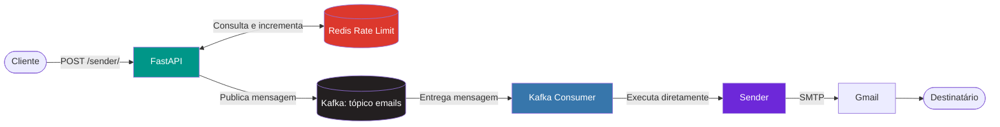
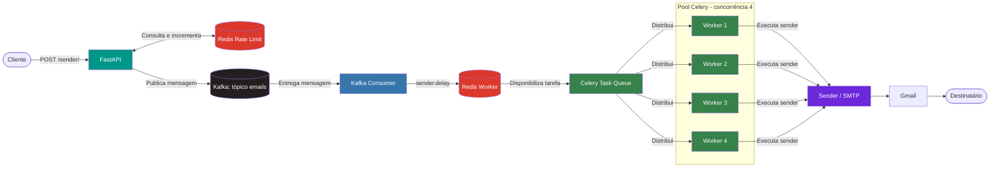

<h1 align="center">📬 MCP Sender</h1>

<p align="center">
  
</p>

<p align="center">
  <strong>Serviço assíncrono e distribuído para envio de e-mails com FastAPI, Kafka, Celery e Redis.</strong>
</p>

<p align="center">
  <a href="https://www.python.org/"></a>
  <a href="https://fastapi.tiangolo.com/"></a>
  <a href="https://kafka.apache.org/"></a>
  <a href="https://docs.celeryq.dev/en/stable/"></a>
  <a href="https://redis.io/"></a>
  <a href="https://www.docker.com/"></a>
</p>

<p align="center">
  <a href="https://git-scm.com/"></a>
  <a href="https://github.com/BrayanDevZN/mcp_sender"></a>
  <a href="https://github.com/BrayanDevZN/mcp_sender/actions/workflows/build.yml"></a>
  <a href="https://github.com/BrayanDevZN/mcp_sender/stargazers"></a>
  <a href="https://github.com/BrayanDevZN/mcp_sender/forks"></a>
  <a href="https://github.com/BrayanDevZN/mcp_sender/issues"></a>
  <a href="https://docs.celeryq.dev/en/stable/"></a>
</p>

<p align="center">
  <a href="https://github.com/BrayanDevZN/mcp_sender/commits"></a>
  <a href="https://github.com/BrayanDevZN/mcp_sender"></a>
  <a href="https://github.com/BrayanDevZN/mcp_sender"></a>
  <a href="https://hub.docker.com/r/brayandevzn/mcp_sender"></a>
  <a href="LICENSE"></a>
  
</p>

<p align="center">
  <a href="#-sobre-o-projeto">Sobre</a> •
  <a href="#-versões">Versões</a> •
  <a href="#arquitetura-alpine">Arquitetura Alpine</a> •
  <a href="#arquitetura-v1">Arquitetura v1</a> •
  <a href="#-instalação-e-execução">Instalação</a> •
  <a href="#-uso-da-api">API</a> •
  <a href="#-testes">Testes</a> •
  <a href="#-cicd">CI/CD</a>
</p>

---

## 📖 Sobre o projeto

O **MCP Sender** é um microsserviço de envio de e-mails projetado com arquitetura orientada a eventos. A API recebe a solicitação, valida os dados, aplica o controle de requisições e publica a mensagem no Apache Kafka. O processamento ocorre em segundo plano, mantendo a API responsiva e separando o recebimento da execução do envio.

O projeto possui duas versões funcionais que representam etapas da evolução da arquitetura:

- **Versão Alpine:** processamento assíncrono com FastAPI, Kafka, Redis e um consumer dedicado;
- **Versão v1:** adiciona Celery e workers concorrentes para distribuir as tarefas de envio após o consumo das mensagens do Kafka.

Toda a infraestrutura é containerizada e pode ser iniciada pelo Docker Compose usando imagens publicadas no Docker Hub.

## ✨ Funcionalidades

- API REST construída com **FastAPI**;
- validação de payload com **Pydantic**;
- publicação assíncrona de mensagens no **Apache Kafka**;
- tópico `emails` configurado com cinco partições;
- producer Kafka idempotente com `acks=all`;
- controle de requisições por IP e global com **Redis**;
- processamento em segundo plano por consumer dedicado;
- distribuição de tarefas com **Celery** na versão v1;
- execução concorrente com quatro processos de worker na versão v1;
- envio via Gmail/SMTP com **yagmail**;
- retentativas automáticas no serviço de envio;
- CORS configurável por variável de ambiente;
- logs no console e em arquivo;
- imagens Docker dedicadas para os componentes da aplicação;
- pipeline automatizado com **GitHub Actions**.

---

## 🧭 Versões

### Versão Alpine

A versão Alpine processa o envio diretamente no consumer. Depois de receber a mensagem do Kafka, o consumer executa o serviço responsável pela comunicação SMTP.

```text
API → Kafka → Consumer → SMTP → Destinatário
```

Use esta versão para executar o fluxo direto baseado em Kafka:

```bash
docker compose -f sender-alpine.yml up -d
```

Imagens utilizadas:

- `brayandevzn/mcp_sender:base-alpine`
- `brayandevzn/mcp_sender:kafka-alpine`
- `brayandevzn/mcp_sender:api-alpine`
- `brayandevzn/mcp_sender:consumer-alpine`

### Versão v1 — mais recente

A **v1 é a versão mais recente** do MCP Sender. Ela inclui uma camada de tarefas distribuídas: o consumer do Kafka cria uma tarefa no Celery, e um dos quatro workers concorrentes recebe essa tarefa pelo Redis e realiza o envio.

```text
API → Kafka → Consumer → Celery/Redis → Worker → SMTP → Destinatário
```

Use esta versão para executar a arquitetura com Celery:

```bash
docker compose -f sender-v1.yml up -d
```

Imagens utilizadas:

- `brayandevzn/mcp_sender:base-v1`
- `brayandevzn/mcp_sender:kafka-v1`
- `brayandevzn/mcp_sender:api-v1`
- `brayandevzn/mcp_sender:consumer-v1`
- `brayandevzn/mcp_server:worker-v1`

### Comparação entre as versões

| Recurso | Versão Alpine | Versão v1 |
|---|:---:|:---:|
| FastAPI | ✅ | ✅ |
| Apache Kafka | ✅ | ✅ |
| Redis para rate limit | ✅ | ✅ |
| Consumer Kafka | ✅ | ✅ |
| Envio SMTP | Direto pelo consumer | Executado pelo worker |
| Celery | — | ✅ |
| Redis para tarefas | — | ✅ |
| Workers concorrentes | — | ✅, 4 workers |
| Compose com imagens publicadas | `sender-alpine.yml` | `sender-v1.yml` |

---

<a id="arquitetura-alpine"></a>

## 🏗️ Arquitetura da versão Alpine

A versão Alpine utiliza o Kafka como núcleo do processamento assíncrono. A API recebe a solicitação e publica uma mensagem; o consumer processa essa mensagem e executa diretamente o envio SMTP. O Redis é usado pelo middleware de rate limit.

### Componentes da versão Alpine

| Componente | Responsabilidade |
|---|---|
| **Cliente** | Envia a requisição HTTP com destinatário, assunto e conteúdo. |
| **FastAPI** | Valida o payload, aplica o middleware e responde ao cliente. |
| **Redis** | Mantém os contadores de requisições por IP e o contador global. |
| **Kafka Producer** | Gera o UUID e publica a mensagem no tópico `emails`. |
| **Apache Kafka** | Armazena e distribui as mensagens entre as cinco partições do tópico. |
| **Kafka Consumer** | Lê as mensagens e coordena a execução do serviço de envio. |
| **Sender** | Autentica no Gmail e envia o e-mail por SMTP usando `yagmail`. |

### Diagrama da versão Alpine



### Fluxo da versão Alpine

1. O cliente envia `email`, `subject` e `body` para `POST /sender/`.
2. O middleware consulta no Redis os limites por IP e global.
3. A API valida os dados recebidos com o Pydantic.
4. O producer cria um UUID e publica a mensagem no tópico `emails`.
5. A API devolve `201 Created` com o identificador da mensagem.
6. O consumer recebe a mensagem de uma das partições do Kafka.
7. O consumer chama o `Sender`, que realiza o envio pelo Gmail/SMTP.
8. Depois do processamento, o consumer confirma o offset da mensagem.

### Estrutura de pastas da versão Alpine

```text
mcp_sender/
├── .github/
│   └── workflows/
│       └── build.yml             # Pipeline do GitHub Actions
├── assets/
│   └── mcp-sender.png            # Imagem do projeto
├── src/
│   ├── app/
│   │   ├── api/
│   │   │   ├── manage.py         # Configuração do FastAPI
│   │   │   ├── midlleware.py     # Rate limit da API
│   │   │   ├── router.py         # Endpoint de envio
│   │   │   └── schema.py         # Validação do payload
│   │   ├── server/
│   │   │   ├── broker.py         # Conexão administrativa com o Kafka
│   │   │   ├── consumer.py       # Consumer do tópico emails
│   │   │   ├── manage.py         # Processamento das mensagens
│   │   │   ├── producer.py       # Publicação no Kafka
│   │   │   └── topic.py          # Criação do tópico
│   │   └── main.py               # Entrada da API e do consumer
│   ├── cache/                    # Conexão e controle do Redis
│   ├── logs/                     # Configuração de logs
│   ├── config.py                 # Variáveis de ambiente
│   ├── sender.py                 # Envio via Gmail/SMTP
│   └── service.py                # Serviço de envio direto
├── tests/
│   └── app.py                    # Teste de integração
├── Dockerfile.api                # Container da API
├── Dockerfile.base               # Imagem base Python
├── Dockerfile.consumer           # Container do consumer
├── Dockerfile.kafka              # Broker Kafka em modo KRaft
├── compose.yml                   # Build local da stack
├── sender-alpine.yml             # Stack com imagens Alpine publicadas
├── LICENSE                       # Licença MIT e atribuição
└── requirements.txt              # Dependências Python
```

---

<a id="arquitetura-v1"></a>

## ⚙️ Arquitetura da versão v1

A versão v1 preserva a entrada HTTP, o rate limit e a mensageria Kafka, mas separa o consumo da execução do envio. O consumer transforma cada mensagem do Kafka em uma tarefa Celery. Essa tarefa é armazenada em um Redis dedicado e distribuída entre quatro workers concorrentes.

### Componentes da versão v1

| Componente | Responsabilidade |
|---|---|
| **Cliente** | Envia a solicitação de e-mail para a API. |
| **FastAPI** | Valida a requisição e publica os dados para processamento assíncrono. |
| **Redis Rate Limit** | Controla os limites por IP e global da API. |
| **Kafka Producer** | Publica a mensagem com uma chave UUID no tópico `emails`. |
| **Apache Kafka** | Desacopla a API da etapa responsável por criar a tarefa. |
| **Kafka Consumer** | Consome a mensagem e chama `sender_task`. |
| **Celery** | Registra e distribui a tarefa `sender` para execução assíncrona. |
| **Redis Worker** | Atua como broker na base `0` e backend na base `1` do Celery. |
| **Celery Workers** | Quatro workers concorrentes recebem e executam as tarefas de envio. |
| **Sender** | Envia a mensagem ao destinatário usando Gmail/SMTP. |

### Diagrama da versão v1



### Fluxo da versão v1

1. O cliente envia os dados para `POST /sender/`.
2. O Redis de rate limit valida os contadores da requisição.
3. A API valida o payload e publica a mensagem no Kafka.
4. O cliente recebe `201 Created` com o UUID da mensagem.
5. O Kafka Consumer lê a mensagem do tópico `emails`.
6. O consumer chama `sender_task`, que publica a tarefa com `sender.delay(...)`.
7. O Redis Worker recebe a tarefa e a disponibiliza na fila do Celery.
8. O Celery distribui cada tarefa disponível para um dos quatro workers concorrentes.
9. O worker selecionado executa a tarefa `sender` de forma independente dos demais.
10. O `Sender` autentica no Gmail e entrega o e-mail via SMTP.

### Separação dos serviços Redis na v1

| Serviço | Uso |
|---|---|
| `redis` | Rate limiting da API. |
| `redis-worker` | Broker e armazenamento de resultados das tarefas Celery. |

### Estrutura de pastas da versão v1

```text
mcp_sender/
├── .github/
│   └── workflows/
│       └── build.yml             # Pipeline do GitHub Actions
├── assets/
│   └── mcp-sender.png            # Imagem do projeto
├── src/
│   ├── app/
│   │   ├── api/
│   │   │   ├── manage.py         # Configuração do FastAPI
│   │   │   ├── midlleware.py     # Rate limit da API
│   │   │   ├── router.py         # Endpoint de envio
│   │   │   └── schema.py         # Validação do payload
│   │   ├── server/
│   │   │   ├── broker.py         # Conexão administrativa com o Kafka
│   │   │   ├── consumer.py       # Consumer do tópico emails
│   │   │   ├── manage.py         # Criação das tarefas Celery
│   │   │   ├── producer.py       # Publicação no Kafka
│   │   │   └── topic.py          # Criação do tópico
│   │   └── main.py               # Entrada da API e do consumer
│   ├── cache/                    # Redis usado pelo rate limit
│   ├── logs/                     # Configuração de logs
│   ├── tasks/
│   │   ├── connect.py            # Conexão do Celery com o Redis Worker
│   │   └── manage.py             # Instância e descoberta de tarefas
│   ├── config.py                 # Variáveis de ambiente
│   ├── sender.py                 # Envio via Gmail/SMTP
│   └── service.py                # Definição da tarefa sender
├── tests/
│   └── app.py                    # Teste de integração
├── Dockerfile.api                # Container da API
├── Dockerfile.base               # Imagem base Python
├── Dockerfile.consumer           # Container do consumer Kafka
├── Dockerfile.kafka              # Broker Kafka em modo KRaft
├── Dockerfile.worker             # Pool Celery com quatro workers concorrentes
├── compose.yml                   # Build local da stack v1
├── sender-v1.yml                 # Stack v1 com imagens publicadas
├── LICENSE                       # Licença MIT e atribuição
└── requirements.txt              # Dependências, incluindo Celery
```

---

## 🧱 Stack tecnológica

| Camada | Tecnologia | Responsabilidade |
|---|---|---|
| Linguagem | Python 3.14 | Implementação dos serviços |
| API | FastAPI + Uvicorn | Entrada HTTP e documentação OpenAPI |
| Validação | Pydantic v2 | Validação do corpo das requisições |
| Mensageria | Apache Kafka 4.3.1 | Transporte e armazenamento dos eventos |
| Tarefas distribuídas | Celery 5.6.3 | Distribuição do processamento na v1 |
| Cache | Redis Alpine | Contadores do rate limit |
| Broker de tarefas | Redis Alpine | Broker e backend do Celery na v1 |
| E-mail | yagmail | Comunicação SMTP com o Gmail |
| Containers | Docker Compose | Execução coordenada da infraestrutura |
| Automação | GitHub Actions | Build e teste de integração |

---

## ⚙️ Pré-requisitos

- [Git](https://git-scm.com/);
- [Docker](https://www.docker.com/);
- [Docker Compose](https://docs.docker.com/compose/);
- conta Gmail com uma [senha de app](https://support.google.com/accounts/answer/185833).

Python 3.14+ é necessário apenas para executar os testes diretamente no ambiente local.

---

## 🚀 Instalação e execução

### 1. Clone o repositório

```bash
git clone https://github.com/BrayanDevZN/mcp_sender.git
cd mcp_sender
```

### 2. Configure o ambiente

Crie um arquivo `.env` na raiz:

```env
# Conta utilizada como remetente
email=seuemail@gmail.com

# Senha de app gerada na Conta Google para uso pelo yagmail
password=abcdabcdabcdabcd

# Origem aceita pelo CORS
origin=*

# Limites de requisições dentro da janela de 60 segundos
rate_limit=50
global_rate_limit=200
```

| Variável | Descrição | Exemplo |
|---|---|---|
| `email` | Conta Gmail remetente | `conta@gmail.com` |
| `password` | Senha de app gerada na Conta Google e utilizada pelo `yagmail` | `abcdabcdabcdabcd` |
| `origin` | Origem autorizada pelo CORS | `*` |
| `rate_limit` | Requisições permitidas por IP em 60 segundos | `50` |
| `global_rate_limit` | Requisições globais permitidas em 60 segundos | `200` |

> **Importante:** `password` não é a senha normal usada para entrar no Gmail. É uma **senha de app**, gerada no gerenciamento de segurança da Conta Google para que o `yagmail` possa autenticar no SMTP.

### Como obter a senha usada pelo yagmail

1. Ative a verificação em duas etapas na Conta Google do remetente.
2. Abra o [Gerenciador de Senhas de app da Conta Google](https://myaccount.google.com/apppasswords).
3. Crie uma senha de app para o MCP Sender.
4. Copie a credencial gerada e informe seu valor em `password` no `.env`.

Exemplo completo:

```env
email=mcp.sender@gmail.com
password=abcdefghijklmnop
origin=http://localhost:3000
rate_limit=50
global_rate_limit=200
```

O `yagmail` utiliza essa credencial exclusivamente para autenticar o envio SMTP. O arquivo `.env` está no `.gitignore` e não deve ser enviado ao repositório.

### 3. Escolha e inicie a versão

Para usar a **v1**, versão mais recente, execute o Compose `sender-v1.yml`:

```bash
docker compose -f sender-v1.yml up -d
```

Para usar a versão **Alpine**, execute o Compose `sender-alpine.yml`:

```bash
docker compose -f sender-alpine.yml up -d
```

Cada arquivo Compose utiliza automaticamente as imagens e os serviços correspondentes. Basta escolher o arquivo da versão desejada.

### 4. Acompanhe a aplicação

Versão v1:

```bash
docker compose -f sender-v1.yml ps
docker compose -f sender-v1.yml logs -f
```

Versão Alpine:

```bash
docker compose -f sender-alpine.yml ps
docker compose -f sender-alpine.yml logs -f
```

A API estará disponível em [http://localhost:8000](http://localhost:8000).

### 5. Encerre o ambiente

Versão v1:

```bash
docker compose -f sender-v1.yml down
```

Versão Alpine:

```bash
docker compose -f sender-alpine.yml down
```

---

## 📡 Uso da API

As duas versões oferecem o mesmo contrato HTTP.

### `POST /sender/`

Recebe os dados e enfileira o e-mail para processamento assíncrono.

#### Corpo da requisição

```json
{
  "email": "destinatario@gmail.com",
  "subject": "Assunto do e-mail",
  "body": "Conteúdo da mensagem"
}
```

O campo `email` deve conter um endereço `@gmail.com`.

#### Exemplo com cURL

```bash
curl -X POST http://localhost:8000/sender/ \
  -H "Content-Type: application/json" \
  -d '{
    "email": "destinatario@gmail.com",
    "subject": "Olá!",
    "body": "Mensagem enviada pelo MCP Sender."
  }'
```

#### Resposta de sucesso — `201 Created`

```json
{
  "status": true,
  "id": "3f2a9b7e-df1c-4e2a-9c65-1a2b3c4d5e6f"
}
```

O campo `id` contém o UUID usado como chave da mensagem no Kafka.

### Códigos de resposta

| Código | Descrição |
|---:|---|
| `201` | Mensagem recebida e publicada no Kafka |
| `422` | Dados da requisição inválidos |
| `429` | Limite de requisições atingido |
| `501` | Erro ao publicar a mensagem |

### Documentação interativa

- Swagger UI: [http://localhost:8000/docs](http://localhost:8000/docs)
- ReDoc: [http://localhost:8000/redoc](http://localhost:8000/redoc)

---

## 🧪 Testes

Com a stack escolhida em execução, instale o cliente HTTP e execute o teste de integração:

```bash
python -m pip install requests
python -m tests.app
```

O teste envia uma requisição real à rota `/sender` e exibe o identificador retornado pela API, percorrendo o fluxo integrado da versão em execução.

---

## 🔄 CI/CD

O workflow [`.github/workflows/build.yml`](.github/workflows/build.yml) executa automaticamente a integração do projeto no GitHub Actions em pushes e Pull Requests.

O pipeline realiza as seguintes etapas:

1. obtém o código do repositório;
2. configura o Python 3.14;
3. cria o arquivo de ambiente com os GitHub Secrets;
4. inicia a stack pelo Docker Compose;
5. aguarda a inicialização dos serviços;
6. instala o cliente de testes;
7. executa o teste de integração.

### Secrets do ambiente `develop`

| Secret | Finalidade |
|---|---|
| `EMAIL` | Conta Gmail usada pelo serviço |
| `PASSWORD` | Senha de app da conta remetente |

O badge **CI/CD** no topo mostra o resultado mais recente do workflow.

---

## 🌿 Fluxo com Git e GitHub

```bash
git switch -c feature/minha-feature

git add .
git commit -m "feat: adiciona nova funcionalidade"
git push -u origin feature/minha-feature
```

Depois do push, abra um Pull Request no GitHub descrevendo o objetivo, as alterações realizadas e a validação executada.

### Convenção sugerida

| Tipo | Uso |
|---|---|
| `feat` | Nova funcionalidade |
| `fix` | Correção de comportamento |
| `docs` | Documentação |
| `test` | Testes |
| `refactor` | Refatoração interna |
| `ci` | Pipeline e automações |
| `chore` | Manutenção geral |

---

## 🤝 Contribuindo

1. Faça um fork do projeto.
2. Crie uma branch de trabalho.
3. Implemente e valide a alteração.
4. Use commits objetivos e descritivos.
5. Envie a branch para o GitHub.
6. Abra um Pull Request.

---

## 🔗 Links úteis

- [Repositório no GitHub](https://github.com/BrayanDevZN/mcp_sender)
- [Execuções do GitHub Actions](https://github.com/BrayanDevZN/mcp_sender/actions)
- [Issues do projeto](https://github.com/BrayanDevZN/mcp_sender/issues)
- [Imagens no Docker Hub](https://hub.docker.com/r/brayandevzn/mcp_sender)

---

## 📄 Licença

Este projeto é distribuído sob a [Licença MIT](LICENSE). Você pode usar, copiar, modificar e distribuir o código, inclusive em projetos comerciais, desde que preserve o aviso de copyright e o texto da licença, mantendo o devido crédito ao autor.

---

<p align="center">
  Desenvolvido com 💙 usando FastAPI, Kafka, Celery, Redis e Docker.
</p>
